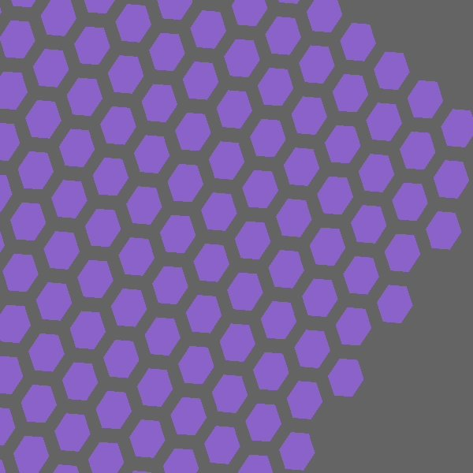

# Designing detectors and collimators

When the shipped [camera presets](systems.md) do not match what you want to study, you can build the
collimator and detector yourself. You set their materials, dimensions, and design entirely in the
OpenTOPAS parameter file, with no C++, and you can load CAD-designed parts for shapes the parametric
classes do not cover. Worked decks for everything below are in
[`examples/design/`](https://github.com/bertoletlab/topas-spect-release/blob/main/examples/design/).

Every geometry is a standard OpenTOPAS component. Set `s:Ge/<name>/Type` to the class, give it a
`Parent`, a `Material`, its design parameters, and a placement (`TransX/Y/Z`, `RotX/Y/Z`), then attach
any scorer with `s:Sc/<scorer>/Component = "<name>"`.

## Collimators


*A `TsParallelHoleCollimator` with hexagonal holes on a hexagonal lattice (OpenTOPAS geometry view).*

| Design | Class | Use |
|--------|-------|-----|
| Parallel-hole | `TsParallelHoleCollimator` | LEHR/ME/HE clinical SPECT; round/hex/square holes |
| Converging (fan/cone-beam) | `TsParallelHoleCollimator` with a focal length | brain SPECT, magnification |
| Pinhole / multi-pinhole | `TsPinholeCollimator` | thyroid, preclinical, cardiac |
| Slit-slat | `TsSlitSlatCollimator` | hybrid CZT systems |

### Parallel-hole and converging: `TsParallelHoleCollimator`

A regular hole array. The parameters (see the
[README](https://github.com/bertoletlab/topas-spect-release/blob/main/README.md) for the full table) are
`HoleDiameter` (flat-to-flat), `SeptalThickness`, `CollimatorLength`, `NHolesX/Y`, `HoleShape`
(`Round`/`Hex`/`Square`), `Lattice` (`Square`/`Hex`), `Material`, and `Hole/Material`.

To make the collimator converge, set `FocalLengthX` and/or `FocalLengthY`, the distance from the
collimator face to the focus. Each channel then tilts toward that focus:

- both finite gives a **cone-beam** collimator converging to a point;
- one finite gives a **fan-beam** collimator with a focal line;
- a negative value gives a diverging collimator;
- `0` (the default) gives a parallel collimator.

A converging collimator magnifies by `m = f / (f − z)` for a source at distance `z`. See
[`converging_conebeam.txt`](https://github.com/bertoletlab/topas-spect-release/blob/main/examples/design/converging_conebeam.txt).

### Pinhole and multi-pinhole: `TsPinholeCollimator`

An absorber plate with one or more knife-edge (double-cone) apertures. The parent volume (vacuum)
fills the aperture. Keep the plate large enough to cover the detector field of view, so photons reach
the crystal only through the pinhole(s).

| Parameter | Meaning |
|-----------|---------|
| `Material` | plate/absorber (for example `Lead`, `Tungsten`) |
| `PlateThickness` | absorber thickness (z) |
| `PinholeDiameter` | aperture diameter at the knife edge |
| `AcceptanceAngle` | full opening angle of the double cone (default 90 deg) |
| `NPinholesX`, `NPinholesY` | pinhole grid (default 1×1, a single pinhole) |
| `PinholePitch` | center-to-center pinhole spacing |
| `PlateHLX`, `PlateHLY` | plate transverse half-size (default covers the grid plus one pitch) |
| `FocalLength` | 0 for axial pinholes; finite to aim each pinhole at an object-side focus |

A pinhole magnifies by `m = l / h` and inverts the image. See
[`pinhole.txt`](https://github.com/bertoletlab/topas-spect-release/blob/main/examples/design/pinhole.txt) and
[`multipinhole.txt`](https://github.com/bertoletlab/topas-spect-release/blob/main/examples/design/multipinhole.txt).

### Slit-slat: `TsSlitSlatCollimator`

An absorber slab with a stack of rectangular through-slots: a slit aperture in the transaxial (x)
direction crossed with parallel slats in the axial (y) direction.

| Parameter | Meaning |
|-----------|---------|
| `Material` | absorber (slat) material |
| `CollimatorLength` | slab thickness (z) |
| `SlatThickness` | absorber foil thickness between slots (y) |
| `SlatGap` | open slot height (y); slat pitch is `SlatThickness + SlatGap` |
| `NSlats` | number of open slots |
| `SlitWidth` | slot width in x, the slit aperture |
| `Slot/Material` | slot fill (for example `Vacuum`) |

See [`slitslat.txt`](https://github.com/bertoletlab/topas-spect-release/blob/main/examples/design/slitslat.txt).

## Detectors

| Detector | Class |
|----------|-------|
| General pixelated detector | `TsPixelatedBox` (native OpenTOPAS) |
| Continuous crystal slab | `TsBox` (native OpenTOPAS) |
| GE StarGuide CZT | `TsStarGuideDetector` (this package) |

For a general pixelated detector, use the native `TsPixelatedBox`: you choose the pixel material,
size, pitch, and count. The parameters are `Material` (frame), `Pixel/Material`, `NumberOfPixelsX/Y`,
`PixelSizeX/Y/Z`, and `PitchX/Y`. Attach a scorer to the component name
(`Sc/.../Component = "Det"`). Ready-to-include crystal fragments are
[`systems/detector_nai.txt`](https://github.com/bertoletlab/topas-spect-release/blob/main/systems/detector_nai.txt)
and
[`systems/detector_czt.txt`](https://github.com/bertoletlab/topas-spect-release/blob/main/systems/detector_czt.txt);
a worked example is
[`pixelated_detector.txt`](https://github.com/bertoletlab/topas-spect-release/blob/main/examples/design/pixelated_detector.txt).

## CAD import for novel geometries

To model a shape the parametric classes do not cover, design the part in any CAD editor, export it as
binary STL or ASCII PLY, and load it with the native `TsCAD` component:

```
s:Ge/Part/Type       = "TsCAD"
s:Ge/Part/Parent     = "World"
s:Ge/Part/Material   = "NaI"
s:Ge/Part/InputFile  = "path/to/part"   # extension added from FileFormat
s:Ge/Part/FileFormat = "stl"            # "stl" (binary), "ply" (ascii), or "tet"
d:Ge/Part/Units      = 1.0 mm
```

See [`cad_component.txt`](https://github.com/bertoletlab/topas-spect-release/blob/main/examples/design/cad_component.txt)
(with a sample `cube.stl`).

Use CAD for detector housings, pinhole plates, shields, and novel single-piece bodies. Do **not** mesh
a fine multi-hole collimator: 10⁴–10⁵ holes become millions of triangles and navigation slows to a
crawl, so use the parametric `TsParallelHoleCollimator` for hole arrays instead. The mesh must have
consistent outward-facing facet normals; without them `G4TessellatedSolid` cannot tell inside from
outside, and photons pass through as if the part were empty.

### Recommended CAD tools

`TsCAD` reads standard interchange formats, so any tool that exports them works. This package bundles
no CAD software; the free, open-source toolchain below keeps the workflow at zero cost.

| Tool | Role | Output |
|------|------|--------|
| **OpenSCAD** / **CadQuery** | script-based parametric CAD; the design is a text file you version alongside the deck, good for pinhole plates, housings, shields, and novel single-piece bodies | STL (CadQuery also STEP) |
| **FreeCAD** | GUI parametric mechanical CAD, Python-scriptable | STL |
| **Gmsh** + **TetGen** | volumetric/tetrahedral meshing for the `TET` path (`.node`/`.ele`) | TET |
| **3D Slicer** | segment medical imaging into a mesh (anthropomorphic phantoms) | STL |
| **MeshLab** or **Blender** (3D-Print toolbox) | repair and validate the mesh: make it watertight and manifold with outward normals | STL/PLY |

Commercial packages (Fusion 360, Onshape, SolidWorks, Inventor) also export STL and work fine if you
already have them.

Follow this export checklist with any tool: (1) export binary STL or ASCII PLY (or TetGen
`.node`/`.ele`); (2) model in millimeters and set `Ge/<name>/Units = 1.0 mm`; (3) run a repair and
validation pass (MeshLab "Repair non-manifold", or Blender "Make Manifold") so the mesh is watertight,
manifold, and outward-normal; (4) reserve CAD for housings, plates, and novel single-piece parts, and
use the parametric collimators for hole arrays.

## Materials and dimensions

Any component's material is `s:Ge/<name>/Material = "<element-built or NIST material>"`. Build custom
materials from elements (`Ma/<name>/Components` + `Fractions` + `Density`). OpenTOPAS predefines the 88
standard element symbols (`Lead`, `Tungsten`, `Cadmium`, `Zinc`, `Tellurium`, `Sodium`, `Iodine`, and
so on). All dimensions are plain length parameters, so you change them freely.

## Attaching scorers

The package scorers work on any of these geometries:

- `EDepSpectrum` (`TsEDepSpectrum`) records the per-event deposited-energy spectrum and the interaction
  centroid; attach it to the crystal or detector component.
- `StarGuideProjection` (`TsScoreStarGuideProjection`) records a pixel-binned projection with Gaussian
  energy smearing, binning by local position, and works on any box crystal.
- `ForcedDetectionProjection` (`TsForcedDetectionProjection`) is the analytic-collimator fast path for
  [variance reduction](variance_reduction.md).

## Not yet included

Exact-solid CAD exchange through GDML (solids, materials, and hierarchy together) needs a Geant4 build
compiled with GDML/XercesC, which this build omits; using it would mean rebuilding Geant4. The STL/PLY
mesh import above covers the CAD workflow in the meantime.
