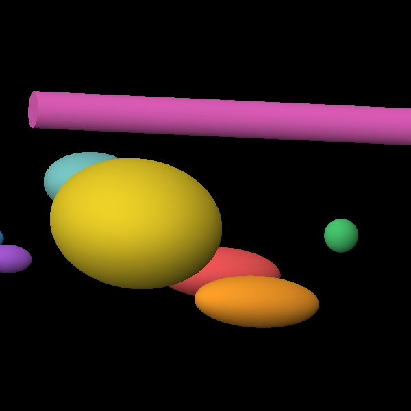

# Patient-like phantoms

To study how a camera performs on a clinically realistic task, you need a source that looks like a
patient: tumor uptake in the liver, physiological uptake in the kidneys and salivary glands, marrow
activity, and metastases, each attenuating and emitting as the real tissue would. This package gives
you two ways to build such a source and image it through any collimator and detector from the
[design chapter](design.md).

> For **quality-assurance** phantoms (Jaszczak, NEMA IEC body, NEMA NU-1 resolution sources)
> used to assess system accuracy, see [QA phantoms](qa_phantoms.md).

The phantoms use only native OpenTOPAS components (`G4Ellipsoid`, `TsSphere`, `volumetric` sources),
so they are self-contained parameter content that runs in any OpenTOPAS deck, whether you are doing SPECT
imaging or dosimetry-methods work. The uptake-ratio evidence behind the presets lives separately in
the lab knowledge base, so the presets stay portable.

## Composable analytic phantoms

*A Lu-177 PSMA scenario: kidneys, liver, spleen, salivary glands, spine, and a nodal metastasis,
with the soft-tissue torso hidden.*

Build a phantom from native shapes, each carrying its own activity. See
[`phantoms/README.md`](https://github.com/bertoletlab/topas-spect-release/blob/main/phantoms/README.md) for
the full recipe: the geometry building blocks, the `volumetric`-source pattern, and the weighting rule
that sets each region's history count in proportion to `concentration × volume`.

Four ready scenario presets, with literature-sourced uptake ratios, are in
[`phantoms/scenarios/`](https://github.com/bertoletlab/topas-spect-release/blob/main/phantoms/scenarios/):

| Preset | Agent | Regions and notes |
|--------|-------|-------------------|
| `lu177_psma.txt` | 177Lu-PSMA (mCRPC) | kidneys, salivary, liver, spleen, spine marrow, plus nodal and bone metastases; 208 keV |
| `ac225_psma.txt` | 225Ac-PSMA (with daughters) | the same parent layout as 177Lu at 218 keV (221Fr), plus a 213Bi kidney-redistribution source at 440 keV (the 440/218 kidney signature) |
| `y90_sirt.txt` | 90Y radioembolization | liver: perfused normal, tumor (T:N ≈ 4), and lung shunt (~5%); β particles produce bremsstrahlung, imaged at ~90–110 keV |
| `i131_mibg.txt` | 131I-mIBG (neuroendocrine) | liver, heart, salivary, adrenal, spleen, bladder, plus a hot tumor; 364 keV |

Each preset is an `IncludeFile` fragment that defines the body, the organs and lesions, and one
weighted source per hot region. Combine it with a collimator, a detector, and a scorer, as in
[`examples/phantom/lu177_psma_projection.txt`](https://github.com/bertoletlab/topas-spect-release/blob/main/examples/phantom/lu177_psma_projection.txt).
Define the acquisition side **inline** in the deck, since OpenTOPAS rejects two parallel top-level
`IncludeFile` chains.

!!! note "Where the uptake ratios come from"
    The uptake ratios are sourced in the workspace knowledge base
    `research/knowledge/rpt-biodistribution/` (not shipped in this repo): 177Lu-PSMA from Violet 2019,
    Okamoto 2017, Delker 2016, Kabasakal 2017, and Hohberg 2023. The literature reports cumulated dose
    (Gy/GBq) far more often than an instantaneous 24 h concentration, so the presets use
    cumulated-dose ratios as relative time-integrated activity, which means a single SPECT image will
    show lower tumor- and salivary-to-kidney contrast than the ratios alone suggest. The literature
    gave no background muscle or blood uptake, so the body is a pure attenuator with no background
    emission; add a low-level background source if your study needs one. The 225Ac, 90Y, and 131I
    scenarios still await their own sourced passes.

## Voxelized XCAT phantoms

For full anatomical realism, use the native OpenTOPAS voxel pipeline, which needs no code from this
package:

- **Attenuation.** `TsImagingToMaterialXcat` converts an XCAT attenuation image into a voxelized
  material geometry. Set `s:Ge/Phantom/Type = "TsImagingToMaterialXcat"` pointing at the XCAT files;
  it assigns a material per XCAT tissue id.
- **Activity.** Emit from a matching XCAT activity image with `TsDicomActivityMap` (or a distributed
  source that reads the activity image), so the source strength follows the image voxel values.

You supply the XCAT attenuation and activity images, which are licensed separately and not shipped
here. Then add a collimator, detector, and scorer as for the analytic phantoms. This path
trades the analytic phantom's easy parameter sweeps for full anatomical realism.

## Imaging a phantom

A phantom is only the source. To take a single view, add a collimator and detector and a scorer, as in
the worked example above. To acquire a full study, in which the detector moves and the isotope decays
over the acquisition time, see [Dynamic acquisitions](dynamic_acquisition.md). Because a collimated
camera detects a tiny fraction of the emitted photons, patient-like runs are count-starved; see
[Variance reduction](variance_reduction.md) for the forced-detection fast path that makes them
tractable.
