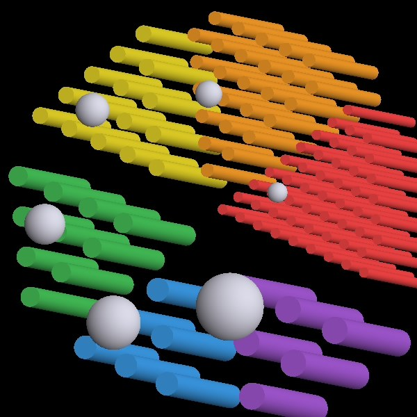
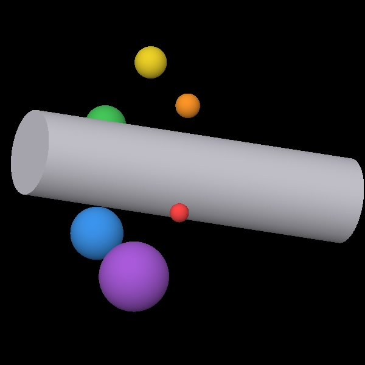

# QA phantoms

The `phantoms/qa/` library encodes the standard nuclear-medicine quality-assurance phantoms, so you can
assess an OpenTOPAS-SPECT system the way you would a real gamma camera: **tomographic uniformity**,
**spatial resolution**, and **contrast recovery**. Every dimension comes from a manufacturer datasheet
or an international standard, not an assumption (provenance in
`research/knowledge/spect-qa-phantom-geometry/`).

## What ships

| Phantom | Encodes | Test it supports |
|---|---|---|
| Jaszczak Deluxe | water cylinder + cold rods + cold spheres | uniformity, resolution, contrast, in one acquisition |
| NEMA IEC body | hot spheres in a warm body with a cold lung | contrast recovery coefficients |
| NEMA NU-1 sources | thin line/point sources at 7.5 cm spacing | system spatial resolution (FWHM) |

## Running one

The phantoms are `IncludeFile` fragments; the shipped example decks image them end-on through a Siemens
Symbia LEHR head (Tc-99m). Run from the example's own folder:

```bash
cd examples/qa
/path/to/OpenTOPAS-build/topas jaszczak_projection.txt
```

Each deck writes a planar projection (`EnergyDeposit` per crystal pixel, CSV). Apply the 140.5 keV
photopeak window in post-processing, and rotate the detector for a tomographic series (see `examples/phantom/spect_acquisition.txt`).

## The Jaszczak phantom


*The six cold-rod sectors (finest red to coarsest purple) and six cold spheres, with the water
cylinder hidden.*

A single water-filled acrylic cylinder (216 mm inner diameter, 186 mm tall, 3.2 mm wall) with three
inserts, so one acquisition covers three tests:

- **Cold rods** — six 60 deg sectors of PMMA rods, one diameter per sector (Deluxe: 4.8 to 12.7 mm),
  in a hex lattice with center-to-center pitch equal to twice the rod diameter (from Jaszczak's patent).
  The finest sector still resolved sets the tomographic spatial resolution.
- **Cold spheres** — six PMMA spheres (9.5 to 31.8 mm) for contrast versus size.
- **Uniform section** — the plain water gives integral and differential uniformity.

Because the rods and spheres are non-active PMMA sitting in a uniformly active water background, they
read as cold voids. Other Jaszczak variants (Ultra Deluxe, Standard, Benchmark) differ only in the rod
and sphere diameters and are one flag away:

```bash
python3 tools/make_qa_phantom.py jaszczak --model ultradeluxe
```

## The NEMA IEC body phantom


*The six fillable spheres (10 to 37 mm) around the central lung insert, body wall hidden.*

The IEC 61675-1 / NEMA NU 2-2018 body: an elliptical PMMA cavity (interior 290 mm lateral x 221 mm AP
x 193 mm, ~9.7 L) holding six fillable spheres (inner diameters 10, 13, 17, 22, 28, 37 mm, centers
70 mm from the lid) and a cold low-density lung insert (45 mm foam, 0.3 g/cm3). The spheres are hot at a
selectable sphere-to-background concentration ratio (default 4:1); measure how much of each sphere's
true concentration you recover as a function of its size.

```bash
python3 tools/make_qa_phantom.py nema-iec --ratio 8   # 8:1 spheres
```

The small spheres carry few counts by design (their activity is concentration x volume, and a 10 mm
sphere is a tiny fraction of a 9.7 L background) — that is exactly why they are the hard ones to
recover. Scale all histories up together to gain statistics without changing the ratio.

## NEMA NU-1 resolution sources

Three thin line sources (capillary bore under 1 mm) at 0 and +/-75 mm, the NEMA 7.5 cm spacing. Imaged
end-on they appear as point spread functions; the fitted FWHM of each is the system spatial resolution.
Add the surrounding 20 cm water cylinder for the with-scatter measurement:

```bash
python3 tools/make_qa_phantom.py resolution --in-water
```

## Caveats

- Emission defaults to Tc-99m (140.5 keV). For another isotope, edit `So/*/VolumetricEnergy` and use a
  collimator preset matched to its energy.
- Sphere walls (~1 mm PMMA) are not modeled — a small, documented approximation.
- The IEC body cross-section is modeled as an ellipse; the exact IEC contour is a slightly non-elliptical
  refinement.
